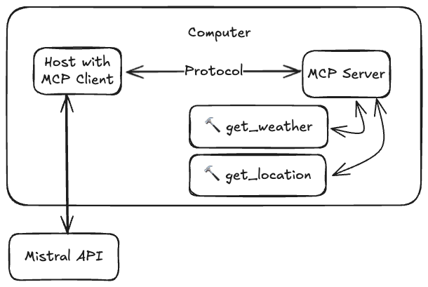

# MCP Example



Example of creating MCP client and server. To run, install `uv` and run

```bash
uv venv
source .venv/bin/activate
uv sync
uv run mcp-client/client.py
```

This will start server and client, and enter an infinite loop for sending messages to the LLM.
Note that no conversation history is being recorded, so messages should be self-contained.

This example is useful for:
- Illustrating the usage of the `mcp` SDK
- Showing how a simple server can be setup
- Demonstrating how the messages are parsed for an LLM to use tools

## Available Tools (Server)
The server implements two tools, which are basically random and return a string:
- get_weather(city: str): Returns a string describing the weather in the city
- get_location(person: str): Returns a string with the name of the city that a person lives

## Client
The client initializes the server and uses a Mistral model (and endpoint) to generate responses.